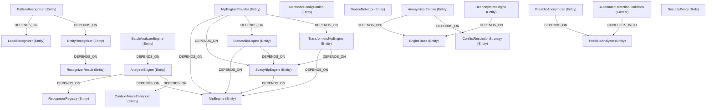

# Brane Demo: microsoft/presidio

**Repo:** [github.com/microsoft/presidio](https://github.com/microsoft/presidio)
**Why:** PII detection and anonymization toolkit — a privacy/ethics-critical system where missed caveats have legal consequences (GDPR, HIPAA). Multiple NLP engine backends with complex configuration validation.

## Summary

| Metric | Count |
|--------|-------|
| Concepts | 85 |
| - Entity | 44 |
| - Caveat | 27 |
| - Rule | 14 |
| Edges | 106 |
| - DEPENDS_ON | 74 |
| - DEFINED_IN | 30 |
| - CONFLICTS_WITH | 2 |

## Knowledge Graph

## What Brane Found

**Architecture:** Two main subsystems — `PresidioAnalyzer` (detect PII) and `PresidioAnonymizer` (redact/replace PII). The analyzer has a pluggable NLP backend: `SpacyNlpEngine`, `StanzaNlpEngine`, and `TransformersNlpEngine` all extend `NlpEngine`, with `NlpEngineProvider` as the factory. The anonymizer has `AnonymizerEngine` and `DeanonymizeEngine` sharing `EngineBase`.

**Caveat density is unusually high (32% of concepts)** — appropriate for a privacy tool:
- `AutomatedDetectionLimitation` — **the most critical caveat**: automated PII detection is inherently imperfect. This CONFLICTS_WITH the entire `PresidioAnalyzer`, correctly flagging that the tool cannot guarantee complete detection.
- `NoPublicDisclosure` — vulnerability reporting must be private (security policy)
- `MutualExclusionConfFileAndNlpConfig` — can't use both config file and programmatic NLP config
- `CountryRecognizersDisabledByDefault` — country-specific PII patterns are opt-in
- `MD5HashDeprecated` — MD5 hash operator deprecated for security
- `HashOperatorRandomSaltDefault` — random salt means non-deterministic hashing
- `ValidationOverridesScore` — custom validation can override confidence scores
- `StanzaOptionalImport` — Stanza NLP engine is an optional dependency

**Rules captured:** Security policy, coordinated vulnerability disclosure, registry language consistency, abstract method contracts, low-score entity multiplier, device environment variable precedence.

## Provenance (selected)

| Source File | Concepts | Notable |
|-------------|----------|---------|
| analyzer_engine.py | 7 | Core engine, registry, NLP integration |
| entity_recognizer.py | 6 | Base recognizer, abstract analyze method |
| pattern_recognizer.py | 8 | Regex-based detection, score override caveat |
| nlp_engine/ (7 files) | 26 | Backend zoo: spacy, stanza, transformers |
| anonymizer_engine.py | 7 | Anonymization, conflict resolution |
| deanonymize_engine.py | 5 | Reversible anonymization |
| SECURITY.md | 4 | Disclosure rules |
| CHANGELOG.md | 8 | Meta-package, deprecations |

## Analysis

Presidio is the strongest validation of brane's caveat extraction thesis. The **AutomatedDetectionLimitation** caveat — buried in README prose — is arguably the single most important thing a developer integrating Presidio needs to understand: _this tool will miss PII_. Traditional code analysis tools would never surface this. Brane makes it a graph node that CONFLICTS_WITH the analyzer, ensuring it can't be ignored.

The high caveat-to-entity ratio (27:44 = 61%) reflects a project where the gotchas _are_ the product. Configuration mutual exclusions, deprecated hash algorithms, disabled-by-default recognizers — these are all integration landmines that brane maps into navigable terrain.
