# Brane Demo: openai/whisper

**Repo:** [github.com/openai/whisper](https://github.com/openai/whisper)
**Why:** Speech-to-text ML model with safety-critical caveats (hallucination detection, precision/recall tradeoffs, hardware fallbacks) and rich architectural layering (audio pipeline, tokenizer, decoder, normalizer subsystems).

## Summary

| Metric | Count |
|--------|-------|
| Concepts | 112 |
| - Entity | 84 |
| - Caveat | 19 |
| - Rule | 9 |
| Edges | 120 |
| - DEPENDS_ON | 93 |
| - DEFINED_IN | 25 |
| - CONFLICTS_WITH | 2 |

## Knowledge Graph

```mermaid
graph TD
    1["WhisperInitModule (Entity)"]
    2["LoadModel (Entity)"]
    3["DownloadFunction (Entity)"]
    4["WhisperModel (Entity)"]
    5["AudioModule (Entity)"]
    6["DecodingModule (Entity)"]
    7["TranscribeModule (Entity)"]
    8["Sha256ChecksumValidation (Rule)"]
    9["NormalizersModule (Entity)"]
    10["BasicTextNormalizer (Entity)"]
    11["EnglishTextNormalizer (Entity)"]
    12["EnglishNumberNormalizer (Entity)"]
    13["EnglishSpellingNormalizer (Entity)"]
    14["RemoveSymbolsAndDiacritics (Entity)"]
    15["SpellingMappingFile (Caveat)"]
    16["NormalizationOrder (Rule)"]
    17["RemoveSymbols (Entity)"]
    18["AdditionalDiacritics (Entity)"]
    19["DiacriticsRemovalCaveat (Caveat)"]
    20["BritishToAmericanMapping (Entity)"]
    21["NormalizerModule (Entity)"]
    22["SpellingNormalizationIsOneDirectional (Caveat)"]
    23["Whisper (Entity)"]
    24["AudioEncoder (Entity)"]
    25["TextDecoder (Entity)"]
    26["MultiHeadAttention (Entity)"]
    27["ResidualAttentionBlock (Entity)"]
    28["ModelDimensions (Entity)"]
    29["SdpaAvailabilityCaveat (Caveat)"]
    30["KvCacheHooks (Entity)"]
    36["DecodingTask (Entity)"]
    37["DecodingOptions (Entity)"]
    38["DecodingResult (Entity)"]
    39["BeamSearchDecoder (Entity)"]
    40["GreedyDecoder (Entity)"]
    48["TranscribeFunction (Entity)"]
    50["DecodeWithFallback (Entity)"]
    55["FP16CpuCaveat (Caveat)"]
    56["HallucinationSilenceThreshold (Rule)"]
    57["TemperatureFallbackRule (Rule)"]
    93["LoadAudio (Entity)"]
    96["LogMelSpectrogram (Entity)"]
    98["FfmpegRequired (Caveat)"]
    1 -->|DEPENDS_ON| 5
    1 -->|DEPENDS_ON| 6
    1 -->|DEPENDS_ON| 7
    1 -->|DEPENDS_ON| 4
    2 -->|DEPENDS_ON| 3
    2 -->|DEPENDS_ON| 4
    3 -->|DEPENDS_ON| 8
    23 -->|DEPENDS_ON| 24
    23 -->|DEPENDS_ON| 25
    23 -->|DEPENDS_ON| 28
    24 -->|DEPENDS_ON| 27
    25 -->|DEPENDS_ON| 27
    27 -->|DEPENDS_ON| 26
    36 -->|DEPENDS_ON| 37
    36 -->|DEPENDS_ON| 38
    36 -->|DEPENDS_ON| 39
    36 -->|DEPENDS_ON| 40
    39 -->|CONFLICTS_WITH| 40
    48 -->|DEPENDS_ON| 5
    48 -->|DEPENDS_ON| 6
    48 -->|DEPENDS_ON| 50
    11 -->|DEPENDS_ON| 12
    11 -->|DEPENDS_ON| 13
    11 -->|DEPENDS_ON| 14
    96 -->|DEPENDS_ON| 93
```

## What Brane Found

**Architecture:** Whisper has a clean layered architecture — `WhisperInitModule` is the root, pulling in `AudioModule`, `DecodingModule`, and `TranscribeModule`. The model itself (`Whisper`) composes `AudioEncoder` and `TextDecoder` through `ResidualAttentionBlock` and `MultiHeadAttention`.

**Key caveats surfaced:**
- `FP16CpuCaveat` — FP16 doesn't work on CPU, silent precision loss risk
- `HallucinationSilenceThreshold` — rule for detecting hallucinated output in silent audio
- `SdpaAvailabilityCaveat` — scaled dot-product attention may not be available on all PyTorch versions
- `FfmpegRequired` — hard external dependency not declared in Python deps
- `SpellingNormalizationIsOneDirectional` — British-to-American mapping is lossy
- `BeamSizeBestOfConflict` — beam search and best_of parameters conflict

**Conflicts detected:** `BeamSearchDecoder` CONFLICTS_WITH `GreedyDecoder` — mutually exclusive decoding strategies correctly identified.

**Rules captured:** Checksum validation on model downloads, normalization ordering, temperature fallback for failed decodings, hallucination silence threshold.

## Provenance (selected)

| Source File | Concepts | Notable |
|-------------|----------|---------|
| whisper/\_\_init\_\_.py | 8 | Module root, model loading, checksum rule |
| whisper/model.py | 8 | Core architecture: Whisper, AudioEncoder, TextDecoder |
| whisper/decoding.py | 12 | Decoding strategies, beam vs greedy conflict |
| whisper/transcribe.py | 12 | Pipeline orchestration, hallucination + FP16 caveats |
| whisper/audio.py | 7 | Audio loading, mel spectrograms, ffmpeg dependency |
| whisper/tokenizer.py | 8 | Tiktoken integration, language validation |
| whisper/timing.py | 8 | Word-level alignment, Triton fallback |
| README.md | 6 | Model tiers, turbo translation limitation |

## Analysis

Whisper is a well-structured project where brane's extraction reveals the **implicit safety surface**: hardware fallbacks (FP16, CUDA, Triton), hallucination detection thresholds, and lossy normalization. These are exactly the kinds of buried assumptions that cause production incidents — they live in docstrings and comments, not in APIs or type signatures. Brane's caveat extraction makes them first-class citizens in the knowledge graph.
