# Brane Demo: vercel/ai

**Repo:** [github.com/vercel/ai](https://github.com/vercel/ai)
**Why:** The dominant AI SDK for TypeScript — complex middleware/streaming architecture, tool approval flows with safety implications, and the largest TypeScript codebase of the three demos (full AST pipeline exercised).

## Summary

| Metric | Count |
|--------|-------|
| Concepts | 459 |
| - Entity | 306 |
| - Caveat | 103 |
| - Rule | 50 |
| Edges | 696 |
| - DEPENDS_ON | 540 |
| - DEFINED_IN | 152 |
| - CONFLICTS_WITH | 4 |

## Knowledge Graph (top 100 nodes)

```mermaid
graph TD
    1["PrepareStepFunction (Entity)"]
    2["PrepareStepResult (Entity)"]
    3["StepResult (Entity)"]
    4["PrepareStepOverridesModel (Caveat)"]
    6["ReasoningOutput (Entity)"]
    8["GenerateTextModule (Entity)"]
    9["StreamTextModule (Entity)"]
    10["OutputModule (Entity)"]
    11["SmoothStream (Entity)"]
    12["StopCondition (Entity)"]
    13["ToolSet (Entity)"]
    16["TypedToolError (Entity)"]
    20["OutputInterface (Entity)"]
    21["TextOutput (Entity)"]
    22["ObjectOutput (Entity)"]
    23["ArrayOutput (Entity)"]
    26["NoObjectGeneratedError (Entity)"]
    29["Output (Entity)"]
    31["RunToolsTransformation (Entity)"]
    33["NoSuchToolError (Entity)"]
    35["ToolApprovalFlow (Caveat)"]
    36["ProviderExecutedToolsSkipLocalExecution (Rule)"]
    37["FinishHeldUntilToolResultsComplete (Rule)"]
    39["ExecuteToolCall (Entity)"]
    40["ParseToolCall (Entity)"]
    41["IsApprovalNeeded (Entity)"]
    44["GenerateText (Entity)"]
    45["GenerateTextResult (Entity)"]
    47["PrepareStep (Entity)"]
    51["ExecuteTools (Entity)"]
    52["MultiStepLoop (Caveat)"]
    53["OutputParsingOnStopOnly (Rule)"]
    65["GeneratedFile (Entity)"]
    75["DynamicTools (Entity)"]
    76["Tool (Entity)"]
    81["ToResponseMessages (Entity)"]
    86["PruneMessages (Entity)"]
    88["ModelMessage (Entity)"]
    91["ToolCallBackwardTracing (Rule)"]
    93["StreamText (Entity)"]
    96["ToolCallRepairFunction (Entity)"]
    97["InvalidToolInputError (Entity)"]
    98["TypedToolCall (Entity)"]
    100["ToolApprovalRequestOutput (Entity)"]
    44 -->|DEPENDS_ON| 45
    44 -->|DEPENDS_ON| 12
    44 -->|DEPENDS_ON| 47
    44 -->|DEPENDS_ON| 51
    44 -->|DEPENDS_ON| 77
    44 -->|DEPENDS_ON| 66
    51 -->|DEPENDS_ON| 35
    29 -->|DEPENDS_ON| 21
    29 -->|DEPENDS_ON| 22
    29 -->|DEPENDS_ON| 23
    22 -->|DEPENDS_ON| 26
    23 -->|DEPENDS_ON| 26
    13 -->|DEPENDS_ON| 76
    3 -->|DEPENDS_ON| 13
    31 -->|DEPENDS_ON| 39
    31 -->|DEPENDS_ON| 40
    31 -->|DEPENDS_ON| 41
    36 -->|DEPENDS_ON| 31
    37 -->|DEPENDS_ON| 31
    41 -->|DEPENDS_ON| 13
    41 -->|DEPENDS_ON| 98
    40 -->|DEPENDS_ON| 96
    96 -->|DEPENDS_ON| 97
    86 -->|DEPENDS_ON| 88
    12 -->|DEPENDS_ON| 3
    12 -->|DEPENDS_ON| 13
    45 -->|DEPENDS_ON| 13
    45 -->|DEPENDS_ON| 29
    45 -->|DEPENDS_ON| 3
```

## What Brane Found

**Architecture:** The AI SDK is organized around `GenerateText` and `StreamText` as twin entry points, both depending on `StopCondition`, `ToolSet`, `PrepareStep`, and `ExecuteTools`. The output system (`Output` -> `TextOutput`, `ObjectOutput`, `ArrayOutput`, etc.) provides structured generation. Tool execution flows through `RunToolsTransformation` -> `ExecuteToolCall` -> `ParseToolCall` -> `IsApprovalNeeded`.

**Safety-critical patterns surfaced:**
- `ToolApprovalFlow` — tools can require human approval before execution, a key safety gate for agentic AI
- `ProviderExecutedToolsSkipLocalExecution` — when the provider already ran a tool, local execution is skipped (trust boundary)
- `FinishHeldUntilToolResultsComplete` — finish signal is deferred until all tool results resolve
- `MultiStepLoop` — multi-step agent loops need explicit stop conditions to prevent runaway execution
- `OutputParsingOnStopOnly` — structured output is only parsed on stop, not mid-stream
- `ToolCallBackwardTracing` — tool calls trace backward through message history for pruning decisions
- `InvalidToolInputError` / `ToolCallRepairFunction` — malformed tool inputs can be repaired automatically

**Caveat highlights (103 total):**
- `PrepareStepOverridesModel` — step preparation can silently override the model
- `CallbackErrorResilience` — callback errors are swallowed to not break the pipeline
- `PartialOutputNoValidation` — partial streaming output skips schema validation
- `ArrayRepairedParseDropsLastElement` — array repair parsing may drop the last element
- `StopConditionLoop` — stop conditions can cause infinite loops
- `DeferredToolCallTracking` — deferred tool calls need special tracking

**Scale:** At 459 concepts and 696 edges, this is by far the densest graph — reflecting the SDK's deep abstraction layers for streaming, tool execution, middleware, model providers, and structured output.

## Provenance (selected)

| Source File | Concepts | Notable |
|-------------|----------|---------|
| generate-text/ (49 files) | ~150 | Core text generation, tool execution, output parsing |
| middleware/ (22 files) | ~80 | Logging, rate limiting, caching middleware |
| agent/ (12 files) | ~40 | Agent architecture, UI streaming |
| model/ (29 files) | ~60 | Provider abstraction, model settings |
| error/ | ~20 | Typed errors, retry logic |
| AGENTS.md | 4 | Package-level agent guidance |

## Analysis

The Vercel AI SDK demonstrates brane's value at scale. With 459 concepts, the knowledge graph becomes a **navigable map** of a codebase that would take days to understand through code reading alone. The tool approval flow — `IsApprovalNeeded` -> `ToolApprovalRequestOutput` -> `NeedsApprovalCanBeBooleanOrFunction` — is a safety-critical path that brane surfaces as a connected subgraph, making it auditable.

The 103 caveats (22% of concepts) reveal the SDK's hidden complexity: streaming edge cases, repair heuristics that drop data, silent model overrides, and callback error swallowing. For anyone building agentic applications on this SDK, these caveats are the difference between a working prototype and a production system.

This was also the only TypeScript demo, meaning the full AST pipeline (tree-sitter parsing -> sentinel generation -> adversarial re-extraction) was exercised. The AST ground truth ensures that every exported function, class, and interface is represented in the graph even if the LLM extraction misses it.
