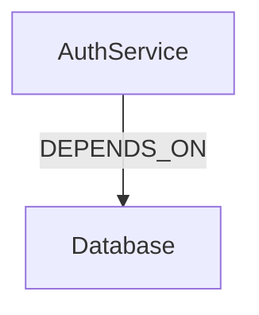

# Research: Graph Explore

**Feature**: 027-graph-explore
**Date**: 2026-02-01

## Research Questions

### 1. ASCII Graph Visualization Approach

**Decision**: Simple hierarchical/adjacency list format with box-drawing characters

**Rationale**:
- Full graph layout algorithms (force-directed, hierarchical) are complex and require external dependencies
- For graphs up to ~20 nodes, a simple list format with indentation is sufficient
- Box-drawing characters (─│┌┐└┘├┤) provide visual structure without special rendering

**Alternatives Considered**:
- Graphviz DOT output → requires external tool to render
- ASCII art with coordinates → complex positioning algorithm needed
- Matrix format → hard to read relationships

**Approach**:
```
[AuthService] Entity
├── DEPENDS_ON → [Database] Entity
├── USES → [Logger] Entity
└── IMPLEMENTS → [IAuth] Interface
```

### 2. Mermaid Output Format

**Decision**: Use Mermaid flowchart syntax with TD (top-down) direction

**Rationale**:
- Mermaid is widely supported (GitHub, VS Code, Notion, etc.)
- Flowchart syntax is simple and readable
- No external dependencies needed - just output valid syntax

**Format**:


### 3. Large Graph Handling

**Decision**: Warn at 20+ nodes for ASCII, suggest --center or --limit flags

**Rationale**:
- ASCII visualization becomes unreadable beyond ~20 nodes
- Mermaid can handle more but rendering may slow
- User should explicitly opt-in to large visualizations

**Thresholds**:
- ASCII warning: >20 nodes
- Mermaid warning: >100 nodes
- Default limit when exceeded: 20 nodes with message

### 4. Neighbor Query Strategy

**Decision**: Single CozoDB query joining edges with concepts in both directions

**Rationale**:
- CozoDB Datalog can efficiently join edges and concepts
- Need both incoming and outgoing edges
- Include relationship details (relation, weight)

**Query Pattern**:
```datalog
# Outgoing edges
?[direction, edge_id, neighbor_id, neighbor_name, neighbor_type, relation, weight] :=
    *edges[edge_id, source, target, relation, weight],
    source = $concept_id,
    *concepts[target, neighbor_name, neighbor_type, _],
    direction = 'outgoing'

# Incoming edges
?[direction, edge_id, neighbor_id, neighbor_name, neighbor_type, relation, weight] :=
    *edges[edge_id, source, target, relation, weight],
    target = $concept_id,
    *concepts[source, neighbor_name, neighbor_type, _],
    direction = 'incoming'
```

### 5. Summary Statistics Query

**Decision**: Separate aggregate queries for counts and distributions

**Rationale**:
- CozoDB supports aggregation functions
- Separate queries are simpler than complex grouping
- Performance is acceptable for expected graph sizes

**Queries**:
```datalog
# Total concepts
?[count(id)] := *concepts[id, _, _, _]

# Total edges
?[count(id)] := *edges[id, _, _, _, _]

# Type distribution
?[type, count(id)] := *concepts[id, _, type, _]

# Relation distribution
?[relation, count(id)] := *edges[id, _, _, relation, _]
```

## Implementation Notes

### Existing Handlers to Reuse

- `/mind/concepts/list` - Already has type filtering, can be used for `brane graph concepts`
- `/mind/edges/list` - Already has relation/source/target filtering, can be used for `brane graph edges`
- `open_mind()` - Standard mind.db access utility
- `is_mind_error()` - Standard error check

### New Handlers Needed

1. `/graph/summary` - New aggregate statistics handler
2. `/graph/neighbors` - New neighborhood query handler
3. `/graph/viz` - New visualization handler

### CLI Command Design

Following the pattern established by `lens`, `concept`, `edge`:

```typescript
export const graph = defineCommand({
  meta: { name: "graph", description: "Explore the knowledge graph" },
  subCommands: {
    summary: { ... },  // Default when just `brane graph`
    concepts: { ... }, // Delegate to /mind/concepts/list
    edges: { ... },    // Delegate to /mind/edges/list
    neighbors: { ... },
    viz: { ... },
  },
})
```

### Visualization Library Location

Create `src/lib/viz.ts` with pure functions:
- `render_ascii(concepts, edges, options)` → string
- `render_mermaid(concepts, edges, options)` → string
- `should_warn_size(node_count, format)` → boolean
